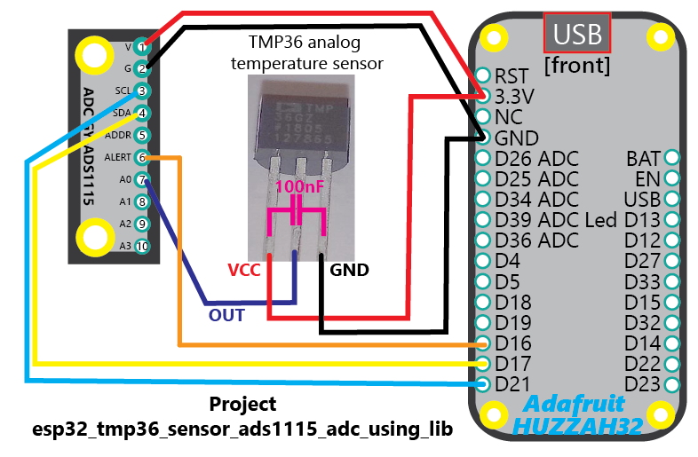

## Project Description
This project demonstrates the components **mjd_ads1115** and **mjd_tmp36**.

The **mjd_ads1115** component for the TI ADS1115 Analog-To-Digital-Convertor is used to read the voltage output of the analog temperature sensor.

The **mjd_tmp36** component for the TMP36 sensor is used to convert the raw voltage reading of the ADC to the ambient temperature in Degrees Celsius.

The **Gain (PGA)** of the ADC is set to **2.048V** for this project to achieve a higher accuracy of the voltage readings (the default of the mjd_ads1115 component is 4.096V). The 2.048V covers the maximum voltage of the TMP36 sensor of 1.75V for +-125 degrees Celsius (its maximum temperature).

Go to the component directory "components/mjd_tmp36" for more documentation, suggested breakout boards (if relevant), installation and wiring instructions, data sheets, FAQ, photo's, etc.

Go to the component directory "components/mjd_ads1115" for more documentation, suggested breakout boards (if relevant), installation and wiring instructions, data sheets, FAQ, photo's, etc.

**The temperature accuracy of this sensor is +-2°C** so don't use this sensor if you want to perform accurate temperature measurements.


## What are the HW SW requirements of the ESP32 MJD Starter Kit?

### Hardware

- A decent ESP development board. I suggest to buy a popular development board with good technical documentation and a significant user base. Examples: [Adafruit HUZZAH32](https://www.adafruit.com/product/3405),  [Espressif ESP32-DevKitC](http://espressif.com/en/products/hardware/esp32-devkitc/overview), [Pycom WiPy](https://pycom.io/hardware/), [Wemos D32](https://wiki.wemos.cc/products:d32:d32).
- The peripherals that are used in the project. The README of each component contains a section "Shop Products".

### Software: ESP-IDF v3.2

- A working installation of the **Espressif ESP-IDF *V3.2* development framework**** (detailed instructions @ http://esp-idf.readthedocs.io/en/latest/get-started/index.html).

```
mkdir ~/esp
cd    ~/esp
git clone -b v3.2 --recursive https://github.com/espressif/esp-idf.git esp-idf-v3.2
```

- A C language editor or the Eclipse IDE CDT (instructions also @ http://esp-idf.readthedocs.io/en/latest/get-started/index.html).


## Lab Setup


## Wiring Diagram
```
TMP36 SENSOR PIN LAYOUT:

PIN#  PIN NAME	  Description
----  ----------  -----------
 1    VCC         Power supply (3.3V for the ESP32)
 2    VOUT        Analog voltage output (the measurement)
 3    GND         Ground
```



```
WIRING DIAGRAM: ADS1115 - MCU:

ADS1115 PIN  MCU PIN#
-----------  -------
V VCC        VCC 3.3V
G GND        GND
SCL          GPIO#21
SDA          GPIO#17
ADDR         --
ALR/RDY      GPIOI#16
```


```
WIRING DIAGRAM: TMP36 - MCU:

TMP36 PIN#  PIN NAME  MCU PIN#
----------  --------  -----------
         1  VCC       GPIO#21
         2  VOUT      VCC 3.3V
         3  GND       GND

- Connect a 0.1uF ceramic capacitor (I chose 100uF) between the TMP36's pins VCC and GND. It should be as close as possible to the VCC pin of the sensor.
```


```
WIRING DIAGRAM: TMP36#1 - ADS1115:

TMP36#1 PIN#  PIN NAME  ADS1115 PIN
------------  --------  -----------
           2  VOUT      A0


Optional:
- Hookup a second TMP36 sensor to the ADS1115 pin A1.
- Hookup a third TMP36 sensor to the ADS1115 pin A2.
```


```
Tips when using long cables:
- When using a long cable, e.g. an Ethernet CAT5E cable of 75cm, between the output line of the sensor and the MCU then put a 1K resistor in series with the output line of the sensor. Place the resistor relatively close to the TMP36 sensor's voltage output pin.

Tips when operating in noisy environments:
- Connect a +-2.2uF tantalum capacitor between the TMP36's pins VCC and GND when the
  device is operated in the presence of high frequency radiated or conducted noise.
```


## Running the example

- Run `make menuconfig` and modify the GPIO PIN#'s that you want to use in the section "MY PROJECT CONFIGURATION". @tip You can also change the log level in Components->Logging: use level INFO for normal operation, use level DEBUG for more detailed logging and to get insights in what the component is actually doing.
- Run `make flash monitor` to build and upload the example to your board and connect to its serial terminal.


## An extract of the UART Debugging Output

```
...
I (349) mjd: *** 19700101000000 Thu Jan  1 00:00:00 1970
I (359) myapp: @tip You can also change the log level to DEBUG for more detailed logging and to get insights in what the component is actually doing.
I (369) myapp: @doc Wait 2 seconds after power-on (start logic analyzer, let peripherals become active, ...)
I (2379) myapp: OK Task has been created, and is running right now
I (2379) myapp: app_main() END
I (2379) gpio: GPIO[13]| InputEn: 0| OutputEn: 1| OpenDrain: 0| Pullup: 0| Pulldown: 0| Intr:0
I (2379) myapp: do mjd_ads1115_init()
I (2399) gpio: GPIO[16]| InputEn: 1| OutputEn: 0| OpenDrain: 0| Pullup: 1| Pulldown: 0| Intr:0
I (2399) mjd_ads1115: ADS1115 Log Device Params (*Read again from registers*):
I (2419) mjd_ads1115:   OPSTATUS:    0x1 0b00000001 (1)
I (2419) mjd_ads1115:   MUX:         0x4 0b00000100 (4)
I (2419) mjd_ads1115:   PGA:         0x2 0b00000010 (2)
I (2419) mjd_ads1115:   OPMODE:      0x1 0b00000001 (1)
I (2429) mjd_ads1115:   DATARATE:    0x0 0b00000000 (0)
I (2439) mjd_ads1115:   COMPARATORMODE:     0x0 0b00000000 (0)
I (2439) mjd_ads1115:   COMPARATORPOLARITY: 0x0 0b00000000 (0)
I (2449) mjd_ads1115:   LATCHINGCOMPARATOR: 0x0 0b00000000 (0)
I (2449) mjd_ads1115:   COMPARATORQUEUE:    0x2 0b00000010 (2)
I (2459) mjd_ads1115:   LOWTHRESHOLD:  0x0 0b0000000000000000 (0)
I (2469) mjd_ads1115:   HIGHTHRESHOLD: 0xFFFF 0b1111111111111111 (65535)
I (2479) mjd_ads1115:   CONVERSIONREADYPININLOWREG: 0x0 0b00000000 (0)
I (2479) mjd_ads1115:   CONVERSIONREADYPININLOWREG: 0x1 0b00000001 (1)
I (2609) mjd_tmp36: TMP36 Analog Temperature Sensor: config:
I (2619) mjd_tmp36:   _offset_volts:                   0.500000
I (2619) mjd_tmp36:   _scale_degrees_celsius_per_volt: 0.010000
I (2629) mjd: *** DATETIME 19700101000002 Thu Jan  1 00:00:02 1970
I (2639) myapp: TMP36 Measurements via the ADS1115 ADC
I (2639) myapp: LOOP: NBR_OF_RUNS 100000

I (2649) myapp: ***Measurement#1
I (2779) myapp:   A0 TMP36:  22.665 Degrees Celsius | ADC Pin A0: raw_value (s int16): 11626 | volt_value (float):  0.727
I (2909) myapp:   A1 TMP36:  22.952 Degrees Celsius | ADC Pin A0: raw_value (s int16): 11672 | volt_value (float):  0.730
I (3039) myapp:   A2 TMP36:  22.652 Degrees Celsius | ADC Pin A0: raw_value (s int16): 11624 | volt_value (float):  0.727

I (5039) myapp: ***Measurement#2
I (5169) myapp:   A0 TMP36:  22.671 Degrees Celsius | ADC Pin A0: raw_value (s int16): 11627 | volt_value (float):  0.727
I (5299) myapp:   A1 TMP36:  22.940 Degrees Celsius | ADC Pin A0: raw_value (s int16): 11670 | volt_value (float):  0.729
I (5429) myapp:   A2 TMP36:  22.652 Degrees Celsius | ADC Pin A0: raw_value (s int16): 11624 | volt_value (float):  0.727

I (7429) myapp: ***Measurement#3
I (7559) myapp:   A0 TMP36:  22.665 Degrees Celsius | ADC Pin A0: raw_value (s int16): 11626 | volt_value (float):  0.727
I (7689) myapp:   A1 TMP36:  22.940 Degrees Celsius | ADC Pin A0: raw_value (s int16): 11670 | volt_value (float):  0.729
I (7819) myapp:   A2 TMP36:  22.646 Degrees Celsius | ADC Pin A0: raw_value (s int16): 11623 | volt_value (float):  0.726

I (9819) myapp: ***Measurement#4
I (9949) myapp:   A0 TMP36:  22.665 Degrees Celsius | ADC Pin A0: raw_value (s int16): 11626 | volt_value (float):  0.727
I (10079) myapp:   A1 TMP36:  22.933 Degrees Celsius | ADC Pin A0: raw_value (s int16): 11669 | volt_value (float):  0.729
I (10209) myapp:   A2 TMP36:  22.621 Degrees Celsius | ADC Pin A0: raw_value (s int16): 11619 | volt_value (float):  0.726

...

```


## Reference: the ESP32 MJD Starter Kit SDK

Do you also want to create innovative IoT projects that use the ESP32 chip, or ESP32-based modules, of the popular company Espressif? Well, I did and still do. And I hope you do too.

The objective of this well documented Starter Kit is to accelerate the development of your IoT projects for ESP32 hardware using the ESP-IDF framework from Espressif and get inspired what kind of apps you can build for ESP32 using various hardware modules.

Go to https://github.com/pantaluna/esp32-mjd-starter-kit


